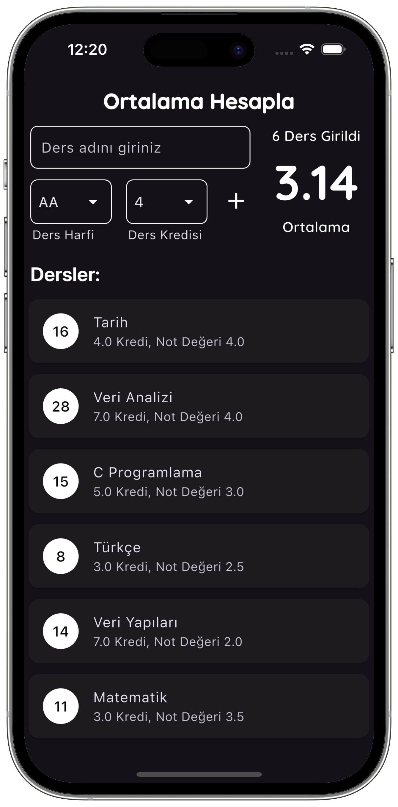
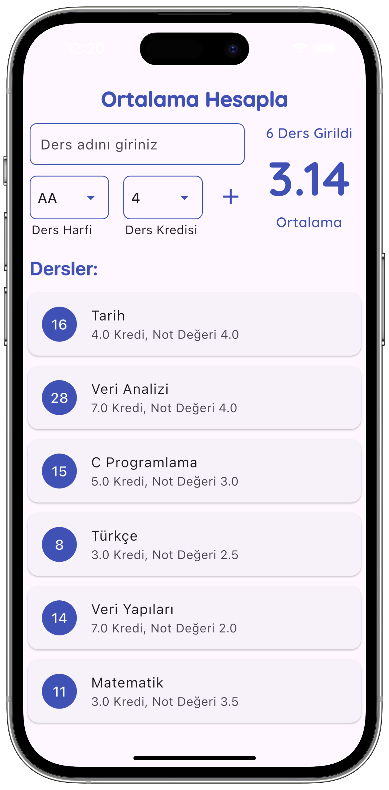

# Flutter GPA Calculator

A simple and responsive Flutter application that allows students to **calculate their GPA (Grade Point Average)** based on course grades and credit values.
---
Flutter ile geliştirilmiş ders not ortalaması hesaplama uygulaması

## Features
- Add and remove course entries
- Select course grade (e.g. A, B+, etc.)
- Choose course credit value
- Real-time GPA calculation
- Light/Dark mode support (optional)

## Screenshots

 

